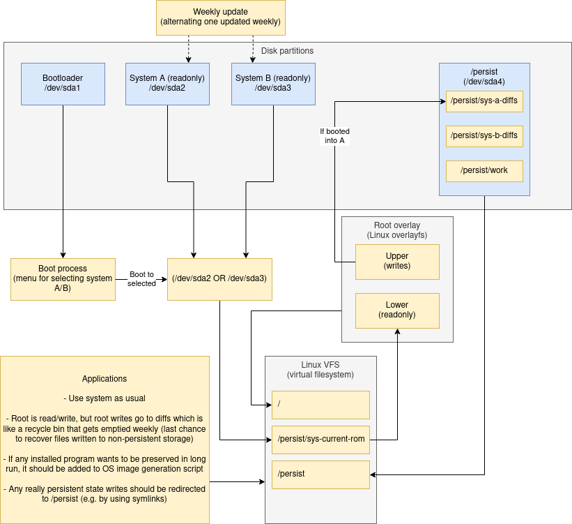
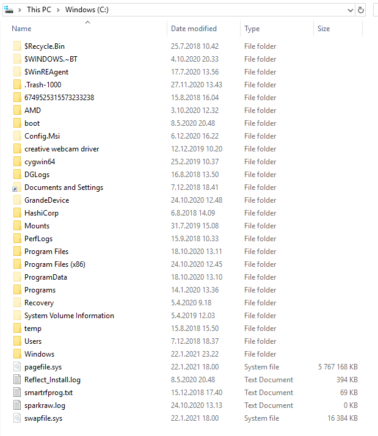
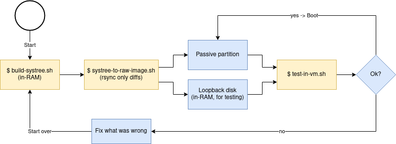

My personal system installation (Ubuntu + programs & conf I use) as a code. You might be
familiar with "dotfiles" - this is a bit further. :) (Because I'm a giant nerd.)

This is not a generic operating system ("distro") that could help you - it's my personalized system,
i.e. difference between an OS and an OS installation after one has set it up for her liking. But I'm
sharing this to share ideas & for other people to get inspired!

In summary, running these scripts produces:

- An image for system partition with up-to-date Ubuntu installation + apps I use + config I use
- An image of boot partition

These two image files can be taken to a totally new computer, boot it with a USB stick containing the
images and use an utility in the USB stick to write the image partitions to the disk and have the
system exactly the way I'm used to using it!


Contents:

- [How does it work](#how-does-it-work)
  * [Partitioning](#partitioning)
  * [No updates to the system](#no-updates-to-the-system)
  * [Installation, configuration, repository file layout](#installation-configuration-repository-file-layout)
  * [Handling state](#handling-state)
- [Why this approach?](#why-this-approach)
  * [Intermingled state](#intermingled-state)
  * [Advantages of storing system state in a VCS](#advantages-of-storing-system-state-in-a-vcs)
  * [Unused software gets removed automatically](#unused-software-gets-removed-automatically)
- [Long-term goals](#long-term-goals)
- [How to use](#how-to-use)
  * [Process](#process)
  * [Scripts](#scripts)
  * [Build environment portability](#build-environment-portability)
- [Road to memory safety](#road-to-memory-safety)
- [Additional reading](#additional-reading)


How does it work
----------------

Summary:

- My system image (OS + installed apps) is immutable
- Despite immutability, testing new software is easy (just `$ apt install <program>` like always)
	* Short-term root state changes (like installing a new program) are redirected to a "diff" tree
	  using [overlayfs](https://wiki.archlinux.org/index.php/Overlay_filesystem) so I don't
	  accidentally lose short-term data after reboot.
	* Short-term data is wiped out weekly on purpose.
	* It is easy for me to audit that I'm not accidentally throwing away important data because I can
	  inspect the diff tree.
* No automatic updates to software, but move to a fresh install of up-to-date system weekly. Ahh,
  that fresh car smell - weekly!
* All configuration comes from this repo ("system state as code").


### Partitioning

Overview as a drawing:



Same in text:

It might be easiest to begin by explaining my partition layout:

```
sda           8:0    0 894.3G  0 disk
├─sda1        8:1    0   256M  0 part /boot/efi
├─sda2        8:2    0  47.7G  0 part
├─sda3        8:3    0  47.7G  0 part /persist/sys-current-rom
└─sda4        8:4    0 798.8G  0 part /persist
```

First partition is UEFI system partition (AKA "ESP") - the bootloader (which is responsible for
starting the OS). `sda2` and `sda3` are equal sized active/passive **readonly** system images.

The persist partition is actually important data (work files, application state), i.e. it doesn't contain
my installed programs or anything a random program decides to write somewhere, even in my `/home`
directory.


### No updates to the system

I disable updates in my OS and the programs (Firefox etc.), but I run these steps weekly:

1. Build & flash a freshly-installed kernel+drivers+programs+settings into the passive partition
2. (Optionally) Test the new passive partition's system in a VM
3. Switch roles of active-passive partitions (the old passive becomes the new active)
4. Reboot into the new active partition

As a result:

- Updates won't ever break my running system all of a sudden
	* Because the system-under-use is never updated
	* Updates are important for security, but I achieve the same by just starting each week with a
	  freshly installed system containing newest packages
	* Semantically my software never gets updated. Software is much simpler if you don't ever have
	  to worry about update logic (or removal for that matter). Crud doesn't just add up. You have
	  to get good at identifying & managing state though!
- I get to decide the exact time when I apply all the updates in an atomic manner. The final straw
  to migrating to Linux was Windows 10 shutting down my computer & VMs when I was not looking. Never
  again.
- If updates break anything, I can rollback by booting into the previous week's system that worked


### Installation, configuration, repository file layout

The most interesting file is [install.sh](install.sh). It specifies all the packages to install.

Second most interesting directory tree is [overrides/](overrides/), which contains all customized
files I want to be present in the image:

- Some software runs with its default configuration (no overrides needed)
- For some software I want to override their files (or provide additional ones)
	* [Firefox is one such example](overrides/usr/lib/firefox/) (disable auto-updates & customize settings)
	* [overrides/home/joonas/.config/](overrides/home/joonas/.config/) pretty much is my "dotfiles"

The `Dockerfile` is mainly about getting this to build anywhere (think: build this Debian-based image
from e.g. Arch Linux) with minimal dependencies.

`bin/bootstrap-and-install.sh` mainly bootstraps Debian installation environment and pivots the chroot
inside to our system tree that we're building and calls `install.sh` where the actual installation
can begin now that we have a working package manager.


### Handling state

There are roughly three categories of data:

| Type of file | Source of data | Stored in | Example |
|--------------|--------|-----------|---------|
| Static file installed by an application | OS package manager | System image | Executable or config file that you didn't change |
| File that only needs to be changed rarely | This repository | System image | Application's config file that you customized, like [Firefox customizations](overrides/usr/lib/firefox/browser/defaults/preferences/user.js) |
| Persistent data, state that changes often | User generated | `/persist` partition | Application's state directories (example: [Docker](overrides/var/lib/docker)) & files, work files, photographs you took etc. |

There's one special case: secret files - like your SSH private keys or other sensitive data, which
basically is rarely-changing data (therefore could be stored in repo), but for security reasons
shouldn't be stored in the repo.
In this case I can make the file
[/home/joonas/.ssh/id_rsa](https://github.com/joonas-fi/joonas-sys/blob/ab68d9e47612ffb8984c37343e21f091e1599445/overrides/home/joonas/.ssh/id_rsa)
be a symlink ("redirect") to `/persist/ssh/id_rsa`, so:

- I can manage the state outside of the repo
- and not have to configure the software to look for the file in my special location.


Why this approach?
------------------

This might seem like much added complexity to you, and that's a fair argument. But I'm thinking I'm
just paying the price beforehand, because it's easier to do it now than later ("Leaning in to the
pain"). Let me explain..


### Intermingled state

The thing that has always bothered me is that computers tend to intermingle (or at least make it too
easy to):

- Interesting state
	* Worth preserving, backing up
- Totally **un**interesting state

This makes migrating to a new computer or mobile device hard. Systems aren't forever, and especially
with Windows it's common wisdom to
[re-install every couple of years](https://twitter.com/joonas_fi/status/1356122493019426816) because
the system has just accumulated too much crud.

As a Windows user I used to obsess over how the data was laid out in my `C:` and `D:` drives. I used
to get angry and anxious if some badly behaving software wrote its data/log files/directories to the
root of the partition:



The above doesn't exactly scream "this is a well-organized system". I especially like
[good old 6749525315573233238](https://www.reddit.com/r/Amd/comments/8pzm63/what_is_the_purpose_of_c6749525315573233238/).

Linux is not immune to this. Here's how my freshly installed home directory looks:

```
/home/joonas/
├── .Xauthority
├── .bash_history
├── .bash_logout
├── .bashrc
├── .cache
├── .config
├── .dbus
├── .dmrc
├── .gnupg
├── .lesshst
├── .local
├── .mozilla
├── .mplayer
├── .profile
├── .selected_editor
├── .ssh
├── .sudo_as_admin_successful
├── .thunderbird
├── .vim
├── .viminfo
├── .wget-hsts
├── .wine
├── .xsession-errors
├── Desktop
├── Downloads
├── snap
└── work -> /persist/work
```

The only entries I placed there were `.config/`, `.ssh/` and `work/`. Most of `./config/` is also
filled up with stuff I didn't choose to put there.

Without the drastic approach I'm taking, I don't think there is other way to manage one's system
state in a way that doesn't leave you with dread on data loss ("did I backup everything I care about?").

You can of course backup your entire system but then you're left with countless unnecessary files
in your backups that you've to keep forever unless you take the time to dig into the backup to inspect
if there were interesting files to recover before deleting the backups of your long-gone system.

Would you say identifying interesting state would be easier to do now (or at most a week after the state
was created), than to leave it for you do do ten years from now?

Now my backup strategy is easy: back up everything under `/persist`. That's it. All other state
(applications to install & their configuration) is defined by this repository, and I consider Git (a
distributed VCS) a sufficient backup - if GitHub loses my data, I still have a local copy (and vice versa).

[Graham Christensen](https://grahamc.com/blog/erase-your-darlings) put it eloquently:

> Over time, a system collects state on its root partition. This state lives in assorted directories
> like /etc and /var, and represents every under-documented or out-of-order step in bringing up the services.
>
>> “Right, run myapp-init.”
>
> These small, inconsequential “oh, oops” steps are the pieces that get lost and don’t appear in your runbooks.
>
>> “Just download ca-certificates to … to fix …”
>
> Each of these quick fixes leaves you doomed to repeat history in three years when you’re finally
> doing that dreaded RHEL 7 to RHEL 8 upgrade.


### Advantages of storing system state in a VCS

Now I get some kickass
[visibility into my system](https://github.com/joonas-fi/joonas-sys/commit/5c82245c04a42b8e9bd6353d7eb098700d0f558f)
& how it's evolved.

As an additional bonus, now I can be more intentional on the system's state changes: it's harder to
accidentally commit a change than just testing some config change traditionally and forgetting it there.


### Unused software gets removed automatically

Because each week you start with a fresh system with your previous uncommitted changes removed, and
there's no remnants from complicated update processes that try to keep a
[system running for decades](https://www.youtube.com/watch?v=t0rCTZ_3TQ4), there's no more anxiety
around thinking if a re-install would fix your problems!

You're always at most a week away from what amounts to 100 % legit fresh install.


Long-term goals
---------------

To serve me well:

- Solve state management
- Reduce complexity - there's tremendous complexity in updating software:
	* Microsoft's MSI
	* Linux's initramfs hooks
	* boot partition versioned kernels and initrd's
	* It all just gets simpler if software doesn't need update/remove/versioning capabilities.
- Minimal operating system itself, move as much to containers like Docker or Snapd (or minimal-dependency binaries like Go can produce)
- Get rid of as much C/C++ (= memory unsafe) code as possible to increase security


How to use
----------

How I use these tools to manage my system.


### Process

I do this weekly:



NOTE: there is no hard requirement to build the systree in RAM, but I do it so:

- I don't end up writing to my passive partition if the build process fails (wrecks the previously
  good partition)
- Reduce unnecessary I/O - after successful build I [rsync](https://en.wikipedia.org/wiki/Rsync) only
  the difference from RAM to the passive partition and thus reduce SSD wear.
- Sure I could use spare space in `/persist` to host a temporary loopback partition to circumvent the
  failed build problem, but I have enough RAM, RAM is faster and it reduces unnecessary disk I/O.


### Scripts

WARNING: these are not safe to run unless you understand what they do first. Some scripts write to
partitions, some scripts modify your boot partition.. Again, I'm sharing these for educational use,
not as safe usable programs for anyone else!

The whole process centers around these:

``` console
$ bin/build-systree.sh
$ bin/systree-to-raw-image.sh
$ bin/test-in-vm.sh
```

(NOTE: `$ sudo` probaby required.)


### Build environment portability

The above build process should work on pretty much any distro, you only need Docker installed
(, and qemu if you want to test the built system in a VM).


Road to memory safety
---------------------

In the graphical stack:

| Component | Memory safe | Program | Notes |
|-----------|-------------|---------|-------|
| Display server | | Xorg | |
| Display manager | | LightDM | |
| Greeter | | lightdm-gtk-greeter | |
| Window manager |  | i3 | [Investigate memory safe alternatives](https://users.rust-lang.org/t/is-there-a-tiling-window-manager-for-linux-that-is-written-and-configurable-in-rust/4407) |
| Compositor |  | compton | |
| Screensaver |  | xfce4-screensaver | |
| Screenshot app |  | xfce4-screenshooter | |
| Notification daemon |  | dunst | |
| Clipboard manager | | xfce4-clipman | |
| Terminal | ✓ | Alacritty | |
| Program launcher | | rofi | |
| Display settings manager | ✓ | autorandr | |
| Media player control | ✓ | Hautomo's playerctl | |


Additional reading
------------------

- [Erase your darlings](https://grahamc.com/blog/erase-your-darlings) (powerful thought: "Leaning in to the pain")

