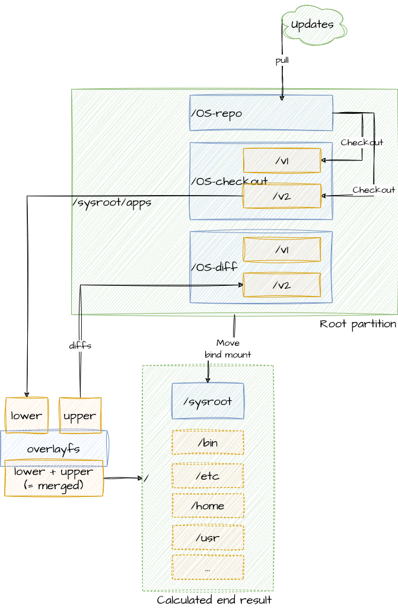
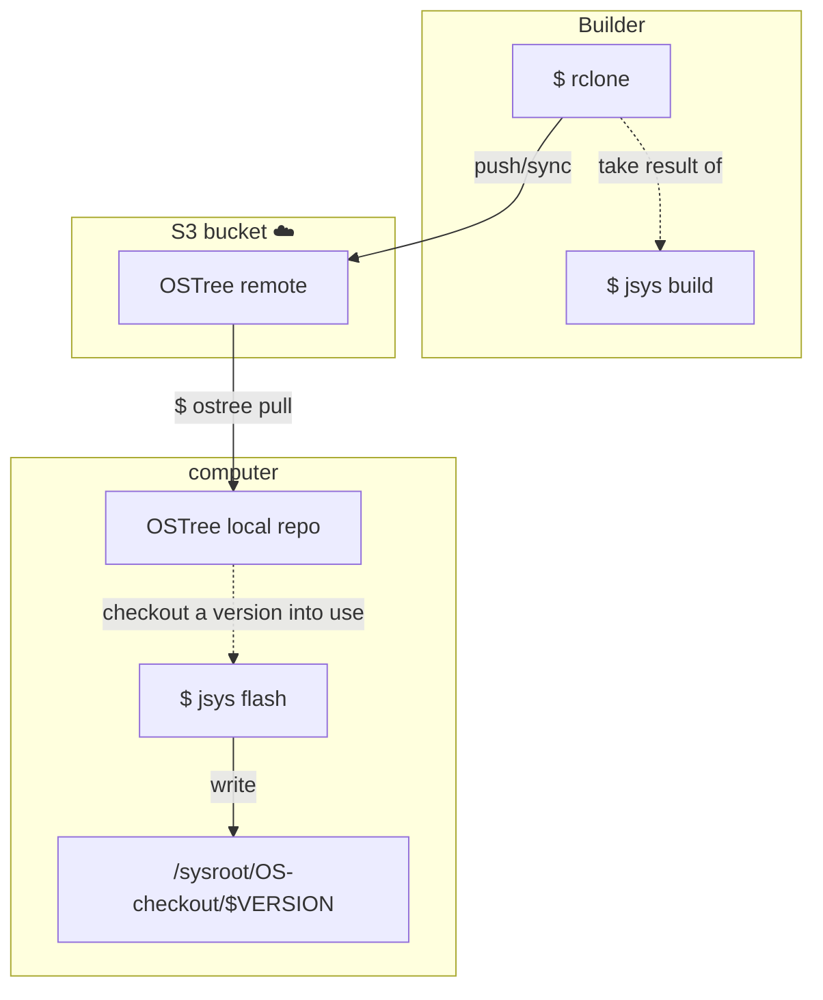

⬆️ For table of contents, click the above icon


My personal system installation (Ubuntu + programs & conf I use) as code. You might be
familiar with "dotfiles" - this is a bit further. :) (Because I'm a giant nerd.)

You can also think of this as my research into how an OS and applications should be configured to maximize:

- usability
- stability
	* nothing breaks during normal daily use. I get to opt in to when things update.
- state separation
	* I know exactly where files that I care about are. They're under `/sysroot`.
	All other files in their traditional places like `/home/<username>` are not interesting.
	You just have to declare total bankrupty on how current sw operates and writes their files because there
	is no useful state separation.
- security
	* mainly by compartmentalization but also by [memory safety](docs/memory-safety-roadmap.md).
- simplicity and understandability via minimalism
	* move as much as possible to containers (containers have well-defined boundaries)
	* not needing update and uninstall during OS normal operation. Remember, we install from scratch
	  and don't update. There's tremendous amount of complexity in updating software: Microsoft's MSI,
	  Linux's initramfs hooks, boot partition versioned kernels and initrd's... It all just gets
	  simpler if software doesn't need update/remove/versioning capabilities.
This is not a generic operating system ("distro") that could help you - it's my personalized system,
i.e. difference between an OS and an OS installation after one has set it up for her liking. But I'm
sharing this to share ideas & for other people to get inspired!

In summary, running these tools contain:

- An image for system partition with up-to-date Ubuntu installation + apps I use + config I use
- Tool for updating bootloader to point to the new system image


Further documentation
---------------------

- [Rationale - why this approach?](docs/rationale.md)
	* This brings important context into why I'm specifically doing things that may seem hard!
- [Manual steps to do after updates](docs/manual-steps.md)
- [Installing on a new system](docs/installing-on-a-new-system.md)
- [Boot process](docs/boot-process.md)


How does it work
----------------

Summary:

- My system image (OS + installed apps) is immutable
- Despite immutability, testing new software is easy (just `$ apt install <program>` like always)
	* Short-term root state changes (like installing a new program) are redirected to a "diff" tree
	  using [overlayfs](https://wiki.archlinux.org/index.php/Overlay_filesystem) so I don't
	  accidentally lose short-term data after reboot.
	* Short-term data is wiped out weekly on purpose.
	* It is easy for me to audit that I'm not accidentally throwing away important data because I can
	  inspect the diff tree.
* No automatic updates to software, but move to a fresh install of up-to-date system weekly. Ahh,
  that fresh car smell - weekly!
* All configuration comes from this repo ("system state as code").


### Filesystem layout

Partitions:

1. Boot partition (more [details](docs/boot-process.md))
2. Root partition

The root partition physically **doesn't** (at root) look like your
[typical Linux filesystem hierarchy](https://en.wikipedia.org/wiki/Filesystem_Hierarchy_Standard)
but instead one is projected at early boot process with [chroot](https://en.wikipedia.org/wiki/Chroot)-like
mechanism (actually implemented with [OverlayFS](https://en.wikipedia.org/wiki/OverlayFS)) from
selected *checkout* in OS-checkout dir.

tl;dr:

- the typical filesystem hierarchy lives at `/sysroot/OS-checkout/$CHECKOUT`
- any writes on top of the typical filesystem hierarchy are written to `/sysroot/OS-diff/$CHECKOUT`

This makes my root partition quite beautifully organized:

```console
$ tree -L 2 /sysroot/
/sysroot/
├── apps
│   ├── Desktop
│   ├── docker
│   ├── flatpak
│   ├── flatpak-appdata
│   ├── git config
│   ├── mcfly
│   ├── netplan
│   ├── OS-checkout
│   ├── OS-diff
│   ├── OS-repo
│   ├── ssh-client
│   ├── ssh-server
│   ├── SYSTEM
│   ├── tailscale-state
│   ├── wireguard-tunnels
│   ├── work
│   └── zoxide
├── lost+found
└── swapfile
```



The above is managed by:

```shell
$ jsys ostree pull
```

> [!TIP]
> The command outputs enough help to guide with the rest.


### No updates to the system

I disable updates in my OS and the programs (Firefox etc.), but I run these steps weekly:

1. Checkout a freshly-installed kernel+drivers+programs+settings
2. (Optionally) Test the new checkout's system in a VM
3. Point the bootloader to the new checkout
4. Reboot into the new active system

As a result:

- Updates won't ever break my running system all of a sudden
	* Because the system-under-use is never updated
	* Updates are important for security, but I achieve the same by just starting each week with a
	  freshly installed system containing newest packages
	* Semantically my software never gets updated. Software is much simpler if you don't ever have
	  to worry about update logic (or removal for that matter). Crud doesn't just add up. You have
	  to get good at identifying & managing state though!
- I get to decide the exact time when I apply all the updates in an atomic manner. The final straw
  to migrating to Linux was Windows 10 shutting down my computer & VMs when I was not looking. Never
  again.
- If updates break anything, I can rollback by booting into the previous week's system that worked


### Installation, configuration, repository file layout

The most interesting location is [install-steps/](install-steps/).
The scripts are run in order and most often use the package manager to install software and/or run custom commands.

(Notice the distinct lack of "configuration management tools" like Ansible/Chef.. turns out you can
make do with simple shell scripts if you don't need the "convergence" properties configuration management
tooling. I.e. installing a system once is far easier than making changes to ever-living system.)

Second most interesting directory tree is [overrides/](overrides/), which contains all customized
files I want to be present in the image:

- Some software runs with its default configuration (no overrides needed)
- For some software I want to override their files (or provide additional ones)
	* [Firefox is one such example](overrides/usr/lib/firefox/) (disable auto-updates & customize settings)
	* [overrides/home/joonas/.config/](overrides/home/joonas/.config/) pretty much is my "dotfiles"

The `Dockerfile` is mainly about getting this to build anywhere (think: build this Debian-based image
from e.g. Arch Linux) with minimal dependencies.

`bin/bootstrap-and-install.sh` mainly bootstraps Debian installation environment and pivots the chroot
inside to our system tree that we're building and calls `install.sh` where the actual installation
can begin now that we have a working package manager.


### Handling state

There are roughly three categories of data:

| Type of file | Source of data | Stored in | Example |
|--------------|--------|-----------|---------|
| Static file installed by an application | OS package manager | System image | Executable or config file that you didn't change |
| File that only needs to be changed rarely | This repository | System image | Application's config file that you customized, like [Firefox customizations](overrides/usr/lib/firefox/browser/defaults/preferences/user.js) |
| Persistent data, state that changes often | User generated | Under `/sysroot` | Application's state directories (example: [Docker](overrides/var/lib/docker)) & files, work files, photographs you took etc. |

There's one special case: secret files - like your SSH private keys or other sensitive data, which
basically is rarely-changing data (therefore could be stored in repo), but for security reasons
shouldn't be stored in the repo.
In this case I can make the file
[/home/joonas/.ssh/id_rsa](https://github.com/joonas-fi/joonas-sys/blob/ab68d9e47612ffb8984c37343e21f091e1599445/overrides/home/joonas/.ssh/id_rsa)
be a symlink ("redirect") to `/persist/ssh/id_rsa`, so:

- I can manage the state outside of the repo
- and not have to configure the software to look for the file in my special location.


### Distribution

I.e. how the updates are distributed to all my computers.

The versioning is handled by [OSTree](https://ostreedev.github.io/ostree/introduction/) which could
be summarized as "git for operating system binaries".
[Flatpak is also built on top of OSTree](https://docs.flatpak.org/en/latest/under-the-hood.html).



