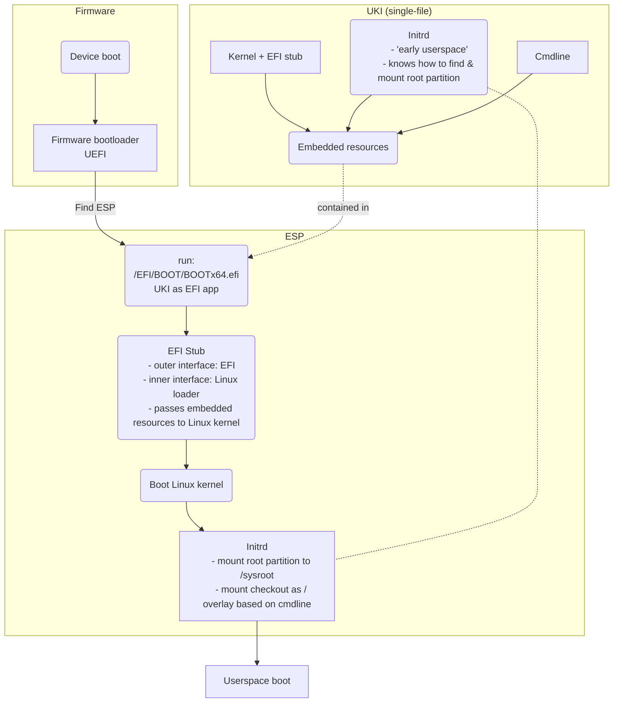

Boot process
============

The boot partition is an [EFI System Partition](https://en.wikipedia.org/wiki/EFI_system_partition).
It contains EFI-bootable [Unified Kernel Image (UKI)](https://wiki.archlinux.org/title/Unified_kernel_image) which
combines into one EFI-bootable file containing:

- the Linux kernel
- [EFI boot stub](https://wiki.archlinux.org/title/EFI_boot_stub) (aka EFI stub)
	* this "adapts" the Linux kernel to boot when invoked by EFI firmware (which expects EFI executable).
- [kernel commandline](https://docs.kernel.org/admin-guide/kernel-parameters.html) and
- [initrd](https://en.wikipedia.org/wiki/Initial_ramdisk).

This means we don't need traditional additional bootloader like Grub.
The commandline instructs which checkout to use.

